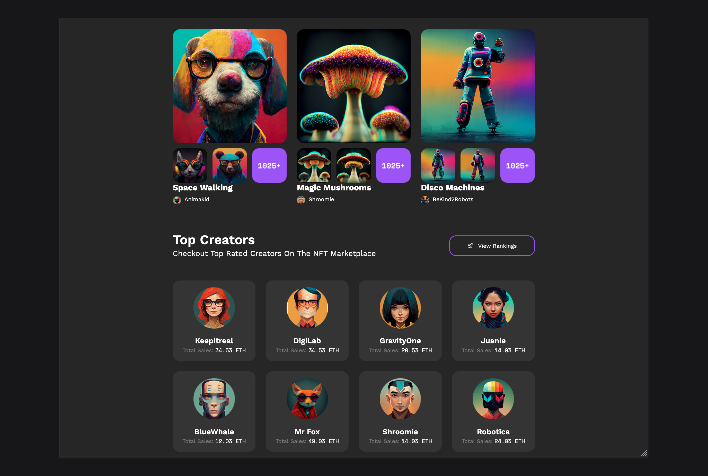
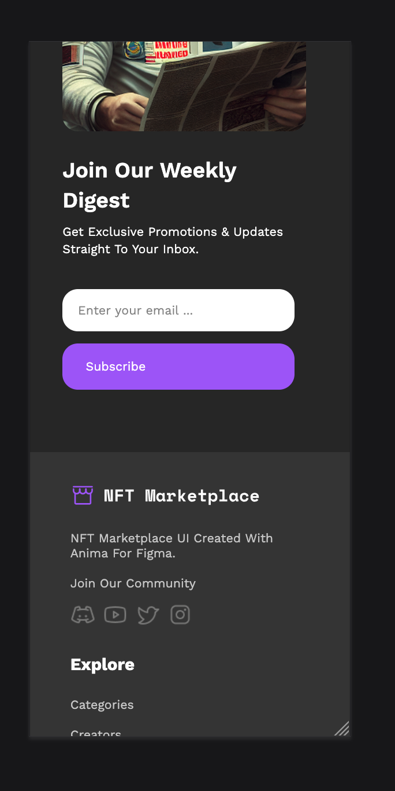
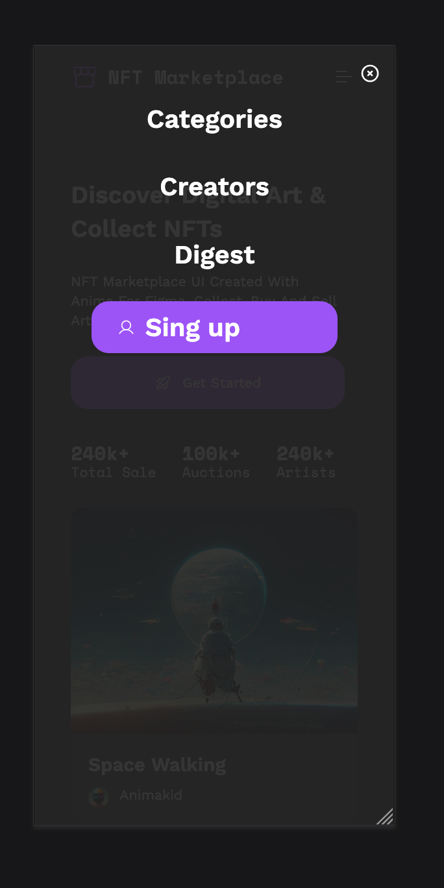

# NFT Landing Page

Responsive one-page NFT marketplace landing built with semantic HTML, modern CSS and a small amount of vanilla JavaScript.  
The main goal of the project is to practice pixel-perfect layout, adaptive design and clean BEM structure for a real portfolio piece.

## Features

- 📱 **Fully responsive layout**
  - Desktop, tablet and mobile breakpoints
  - Flexible grid and spacing system
- 🍔 **Mobile sidebar navigation**
  - Burger menu on smaller screens
  - Slide-in sidebar from the right
  - Dark overlay background
  - Close on:
    - burger button
    - close icon
    - clicking a link
    - clicking on overlay
- 🔗 **Smooth anchor navigation**
  - Header navigation and sidebar links scroll to sections
  - Native smooth scroll with `scroll-behavior`
- 🎨 **Clean UI**
  - Layout based on Figma design
  - Consistent paddings, typography and colors
  - Reusable button styles
- 🧱 **BEM & maintainable CSS**
  - BEM naming for all blocks/elements
  - CSS variables for colors, fonts, etc.
- ♿ **Basic accessibility**
  - Semantic HTML structure
  - Clickable areas for buttons and links

## Tech Stack

- HTML5
- CSS3 (Flexbox, Grid, media queries)
- Vanilla JavaScript (for mobile menu)
- BEM methodology

